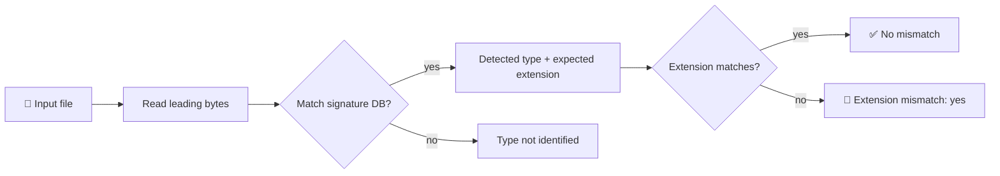

<div align="center">

# 🔍 NEXUS File Identifier

**Identify files by their magic bytes. Catch extensions that lie.**


<br>

[](#-build)
[](#-usage)
[](#-signature-database)
[](#-tests)
[](#-scope-and-limitations)

</div>

---

A small **C++17 command-line tool** that identifies files by their leading magic bytes and reports when the detected type **disagrees with the filename extension**.

> [!NOTE]
> NEXUS is a lightweight inspection aid for triage and education, **not** a malware scanner.

## ✨ At a glance

| | |
|---|---|
| 🎯 **Detects** | File type from the leading magic bytes |
| 🚩 **Flags** | Extension mismatches (`suspicious.jpeg` that isn't what it claims) |
| 📁 **Scans** | A file or all regular files under a directory, recursively |
| 🧪 **Tested** | Temporary byte fixtures, no executable samples in the repo |

## 🔄 How it works



## ⚙️ Build

**Requirements:** a C++17 compiler and GNU Make.

```sh
make
```

The executable is written to the repository root as `nexus-fileid`.

## ▶️ Usage

Analyze one file:

```sh
./nexus-fileid suspicious.jpeg
```

Scan a directory recursively:

```sh
./nexus-fileid Downloads/
```

<details open>
<summary><b>📤 Example output</b></summary>

<br>

Clean file — one line:

```text
[OK] photo.jpg  (JPEG image)
```

Unknown format:

```text
[?] notes.bin
    Type    : Unknown file type
```

Extension mismatch — full warning banner:

```text
========================================
       NEXUS FILE IDENTIFIER
========================================

File          : suspicious.jpeg
Extension     : .jpeg
Detected Type : Windows PE executable
Expected Ext  : .exe

[!] WARNING: Extension mismatch
[!] File content does not match extension
```

Directory scan summary:

```text
Scanning: Downloads/

[OK] photo.jpg  (JPEG image)

[?] notes.bin
    Type    : Unknown file type

========================================
       NEXUS FILE IDENTIFIER
========================================

File          : suspicious.jpeg
Extension     : .jpeg
Detected Type : Windows PE executable
Expected Ext  : .exe

[!] WARNING: Extension mismatch
[!] File content does not match extension

--------------------------------
Files scanned: 3
Mismatches:    1
Unknown:       1
--------------------------------
```

</details>

## 🗂️ Built-in signatures

| Format | Magic bytes | Valid extensions |
|---|---|---|
| JPEG image | `FF D8 FF` | `.jpg` `.jpeg` |
| PNG image | `89 50 4E 47 0D 0A 1A 0A` | `.png` |
| GIF image | `47 49 46 38` | `.gif` |
| BMP image | `42 4D` | `.bmp` |
| TIFF image (LE) | `49 49 2A 00` | `.tif` `.tiff` |
| TIFF image (BE) | `4D 4D 00 2A` | `.tif` `.tiff` |
| RIFF container | `52 49 46 46` | `.wav` `.avi` `.webp` |
| PDF document | `25 50 44 46` | `.pdf` |
| ZIP archive | `50 4B 03 04` | `.zip` `.docx` `.xlsx` `.pptx` `.jar` … |
| GZIP archive | `1F 8B` | `.gz` `.tgz` |
| BZIP2 archive | `42 5A 68` | `.bz2` `.tbz2` |
| XZ archive | `FD 37 7A 58 5A 00` | `.xz` `.txz` |
| RAR archive | `52 61 72 21 1A 07` | `.rar` |
| 7-Zip archive | `37 7A BC AF 27 1C` | `.7z` |
| MP3 audio (ID3) | `49 44 33` | `.mp3` |
| MP3 audio (sync) | `FF FB` | `.mp3` |
| MP4/MOV video | `66 74 79 70` | `.mp4` `.m4v` `.m4a` `.mov` `.3gp` |
| Windows PE executable | `4D 5A` | `.exe` `.dll` `.sys` `.scr` … |
| ELF executable | `7F 45 4C 46` | *(no extension)* |
| Mach-O 32-bit | `CE FA ED FE` | *(no extension)* |
| Mach-O 64-bit | `CF FA ED FE` | *(no extension)* |
| Mach-O fat / Java class | `CA FE BA BE` | `.class` |
| Script (shebang) | `23 21` | `.sh` `.py` `.rb` `.pl` … |

Extension comparisons are **case-insensitive**. Formats marked *no extension* (ELF, Mach-O) flag any file that carries an extension as a mismatch.

## 🧪 Tests

```sh
make test
```

The test target creates temporary byte fixtures and removes them on exit. It
checks single-file analysis, recursive traversal, extension mismatches, and
unknown file counts.

## ⚠️ Scope and limitations

> [!WARNING]
> A matching magic number is an **identification hint, not a security verdict.**

| ✅ NEXUS does | ❌ NEXUS does not |
|---|---|
| Compare signatures against the **start** of each file | Prove that a file is safe |
| Report extension mismatches | Parse or validate the full file format |
| Recursively scan regular files in a directory | Inspect signatures at nonzero offsets |
| Identify 20+ common formats out of the box | Detect every known format |

## 🛡️ Why it matters

File extensions are **user-controlled labels**. Comparing them with a file's binary signature can help surface misleading names during:

- 🔎 triage
- 🚨 incident response
- 🎓 basic security education

---

<div align="center">

**Small tool. Honest scope.** 🧭

[⬆ Back to top](#-nexus-file-identifier)

</div>
