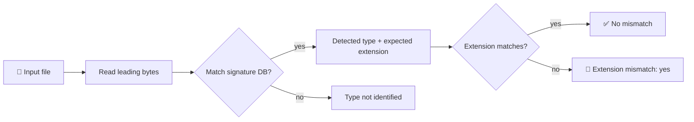

<div align="center">

# 🔍 NEXUS File Identifier

**Identify files by their magic bytes. Catch extensions that lie.**


<br>

[](#-build)
[](#-usage)
[](#-signature-database)
[](#-tests)
[](#-scope-and-limitations)

</div>

---

A small **C++17 command-line tool** that identifies files by their leading magic bytes and reports when the detected type **disagrees with the filename extension**.

> [!NOTE]
> NEXUS is a lightweight inspection aid for triage and education, **not** a malware scanner.

## ✨ At a glance

| | |
|---|---|
| 🎯 **Detects** | File type from the leading magic bytes |
| 🚩 **Flags** | Extension mismatches (`suspicious.jpeg` that isn't what it claims) |
| 🗂️ **Configurable** | Plain-text signature database, one rule per line |
| 🧪 **Tested** | Small temporary byte fixtures, no executable samples in the repo |

## 🔄 How it works



## ⚙️ Build

**Requirements:** a C++17 compiler and GNU Make.

```sh
make
```

The executable is written to `build/nexus-fileid`.

## ▶️ Usage

Run from the repository root to use the included signature database:

```sh
./build/nexus-fileid suspicious.jpeg
```

Or provide a database path explicitly:

```sh
./build/nexus-fileid suspicious.jpeg signatures/signatures.txt
```

<details open>
<summary><b>📤 Example output</b></summary>

<br>

```text
File: suspicious.jpeg
Detected type: JPEG
Expected extension: .jpg
Extension mismatch: yes
Actual extension: .jpeg
```

</details>

## 🗂️ Signature database

One rule per line, in this format:

```text
TYPE|EXTENSION|HEX_BYTES
```

| Field | Meaning |
|---|---|
| `TYPE` | Human-readable name of the format |
| `EXTENSION` | Expected extension, e.g. `.jpg`. **Empty** means no extension is prescribed |
| `HEX_BYTES` | Space-separated bytes expected at the start of the file |

- Blank lines are ignored.
- Lines beginning with `#` are ignored.

<details>
<summary><b>📋 Example rules</b></summary>

<br>

```text
JPEG|.jpg|FF D8 FF
PNG|.png|89 50 4E 47 0D 0A 1A 0A
ELF executable||7F 45 4C 46
```

</details>

## 🧪 Tests

```sh
make test
```

> [!TIP]
> The tests create small temporary byte fixtures. The repository contains no executable samples and no malware.

## ⚠️ Scope and limitations

> [!WARNING]
> A matching magic number is an **identification hint, not a security verdict.**

| ✅ NEXUS does | ❌ NEXUS does not |
|---|---|
| Compare signatures against the **start** of each file | Prove that a file is safe |
| Report extension mismatches | Parse or validate the full file format |
| Use an extensible rule database | Inspect signatures at nonzero offsets |
| | Detect every format (the current database is intentionally small) |

## 🛡️ Why it matters

File extensions are **user-controlled labels**. Comparing them with a file's binary signature can help surface misleading names during:

- 🔎 triage
- 🚨 incident response
- 🎓 basic security education

---

<div align="center">

**Small tool. Honest scope.** 🧭

[⬆ Back to top](#-nexus-file-identifier)

</div>
